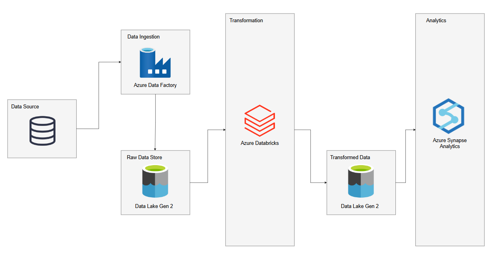

# Making Data Pipeline in Microsoft Azure

## Project Overview
This project demonstrates the development of a complete data engineering pipeline using Microsoft Azure services. The objective was to extract, process, and analyze data related to the Tokyo Olympics 2021. The project showcases the use of various Azure tools to build an efficient and scalable pipeline for data processing and analysis.

 

## Project Workflow

1. **Data Extraction**:
   - **Source**: The data was sourced from a GitHub repository containing detailed statistics and information about the Tokyo Olympics 2021.
   - **Method**: A pipeline was created in Azure Data Factory (ADF) to copy data directly from the GitHub repository.

2. **Data Ingestion**:
   - **Tool Used**: Azure Data Factory (ADF).
   - **Process**: A new pipeline was configured in ADF to ingest raw data from GitHub and store it in Azure Data Lake Storage (ADLS).

3. **Data Transformation**:
   - **Tool Used**: Azure Databricks.
   - **Process**: The raw data in ADLS was processed using Databricks notebooks. The transformation steps included:
     - Correcting incorrect file formats.
     - Removing duplicate records.
     - Handling and removing null values.
   - **Language Used**: Python with PySpark for scalable data processing.
   - **Output**: The transformed data was stored back in ADLS for further analysis.

4. **Data Analysis**:
   - **Tool Used**: Azure Synapse Analytics.
   - **Process**: The transformed data was connected to Synapse Analytics, where advanced analysis was performed using SQL queries to gain insights such as medal counts, athlete performance, and country-specific statistics.

## Technologies and Tools Used
- **Microsoft Azure Services**:
  - Azure Data Factory (ADF) for pipeline orchestration and data ingestion
  - Azure Data Lake Storage (ADLS) for raw and processed data storage
  - Azure Databricks for data transformation and processing
  - Azure Synapse Analytics for data analysis and reporting
- **Languages**: Python, SQL
- **Libraries**: PySpark, Pandas

## Key Insights and Results
- **Medal Analysis**: Identified countries with the highest gold medal counts.


## How to Run This Project
1. **Clone the Repository**:
   ```bash
   git clone https://github.com/username/tokyo-olympics-2021-project.git
   ```

2. **Set Up Azure Environment**:
   - Ensure that you have access to an Azure subscription and services including ADF, ADLS, Databricks, and Synapse Analytics.

3. **Run the Data Pipeline**:
   - Create and configure a new pipeline in Azure Data Factory to copy data from the GitHub source into ADLS.

4. **Execute Databricks Notebooks**:
   - Open Databricks and run the notebooks for data transformation, including file format correction, duplicate removal, and null value handling.

5. **Analyze in Synapse Analytics**:
   - Load the transformed data into Synapse Analytics and run SQL queries for insights.

## Future Improvements
- **Real-time Data Ingestion**: Incorporate real-time data streaming using Azure Event Hubs.
- **Visualization**: Add visual dashboards using Power BI for more interactive data representation.
- **Enhanced Data Modeling**: Implement a star schema in Synapse for optimized querying.

## Conclusion
This project provides a comprehensive look at building a data engineering pipeline with Azure services. It highlights skills in data extraction, pipeline development, data transformation, and advanced analytics, making it an excellent showcase for cloud-based data engineering expertise.

---

Feel free to reach out for any questions or further information!
